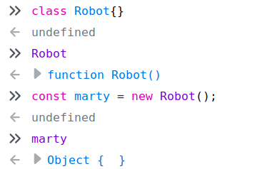
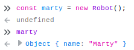

Introduction To Object Oriented Programming
===
Lesson time: 90 minutes

Audience
---
This lesson is inteded for students who have some experience with fundamental
procedural programming concepts, particularly **variables**, **scope**, **data
structures** and **functions**. Students should be confident in their ability to
write useful programs, and eager to learn new tools and techniques for building
more complex applications and systems. Familiarity with Javascript is useful,
but not necessary.

Lesson Materials
---
Students should have access to a Web browser with a Javascript console, such as
Firefox or Chrome. 

Overview
---
In this lession, we will introduce students to the important concepts of Object
Oriented programming.  We will start by describing how **classes** enable
programmers to model real-world objects in software, and enforce this idea by
creating a class and **object** instances in a browser's Javascript console. We
will then take students deeper into the ideas of **encapsulation**,
**inheritance**, and **polymorphism**, with interactive Javascript exercises
along the way. Time permitting, we will conclude with a discussion of some
problematic aspects of OOP such as **multiple inheritance**, and how it might be
avoided with **composition**.

Classes
---

### Instructor Notes

#### Goals
At the end of this section, students will:
  - understand that **classes** are blueprints that can create
      **object** instances.
  - be able to declare **classes**
  - instantiate object instances 

#### Tips
Throughout this lesson, we will be alternating instruction with practice to
enforce key concepts and keep students engaged. We will be using the Javascript
interpreter in a Web browser for exercises, but it's important that students
understand that these concepts are universal. If students get hung up on the
particulars of Javascript's OOP sytnax or mechanics, gently guide them back into
the conceptual realm. After this section, all students should be able type code
into the Javascript console and execute it while understanding that this is just
one implementation of an OOP interface.

We will often refer to Object Oriented Programming as "OOP," for brevity. But
you may want to says "Object Oriented Programming" to avoid confusion. 

### Teach to the students
Object Oriented Programming (OOP) is a concept in software development that
allows programmers to model real world objects. This paradigm is powerful
because it allows humans to more easily manage complex software by leaning
heavily on our intuitive understanding of the world.

Find an object nearby; a desk, a pencil, a laptop, a colleague, or an
instructor. All of these objects can be described in OOP using **classes**,
which define their properties and behaviors. For example, let's look at a pen.

***Ask the class***
> What are some properties that uniquely describe this specific pen?

    Focus on specific attributes of the pen (or other object) in this example:
    color, length, ink type, printed words, smell, condition, etc.

These are the properties of this specific pen. Some other pen may have
completely different properties, but it will still be a class of object that
humans recognize as "a pen." We can create an abstract model of this type of
object using a class, and generalize all pen properties into categories. This
table illustrates how we might  do this, where the first column is the abstract
property, and the other two coloumns are concrete properties held by specific
instances of the class of object we know as "a pen:"

| abstract property | pen 1      | pen 2      |
| ---               | ---        | ---        |
| manufacturer      | Bic        | Montblanc  |
| material          | plastic    | solid gold |
| refillable        | false      | true       |
| tip               | ballpoint  | nib        |
| color             | white      | gold       |
| length            | 5"         | 6.5"       |
| cost              | 0.79       | 1600.00    |

By describing the class of object known as "a pen" in abstract terms, we can
easily describe two wildly different instances such as a disposable ballpoint
pen and an absurdly expensive Montblanc fountain pen.

We can even model intangible things, such as Web pages, calendar reminders,
ocean temperature readings, and public transportation ridership trends. 

***Ask the class***
> What are some practical applications of modeling things and concepts as
> objects in software?

    Good answers might include:
      - tell a machine how to make a pen
      - track company assets
      - build an employee database
      - run global warming simulations
      - dynamically add or remove busses and trains from the transit system to
        meet demand
      - sell items on an e-commerce Web site 

Let's create a Javascript class for an object that is becoming increasingly more
familiar in our everyday lives: a robot. 

Before we start, it's important to understand that Object Oriented Programming
is a concept, or a *paradigm*, supported by most popular programming languages.
Some languages, such as Java and C++ are built around this paradim, while others
such as Python and Javascript support it, allowing you to freely mix and
match OOP and procedural aspects as you see fit. In this lesson, we will use
Javascript because it's readily available in Web browsers and gives us instant
feedback without having to compile or build anything. Just keep in mind that the
concepts we'll cover are shared by all languages that support object oriented
programming.

Let's look at the structure of an empty Robot class in Javascript. Open the
Javascript console in a browser and enter the following:

```javascript
class Robot {}
```

Congratulations! You have **declared** a Robot class! It does absolutely
nothing, but let's look at its parts:

1. The **class** keyword tells the Javascript interpreter that we're
   **declaring** a class. In fact, what you just typed is called a **class
   declaration**.
1. The name, *Robot*, gives us (and the Javscript interpreter) a unique name to
   reference this class later.
1. The body of the class is contained within curly braces, and is currently
   empty. This is where we will definte the robot's characteristics and
   behavior.

We can see what we have created by typing `Robot` into the console. The
Javascript interpreter will respond with whatever the name references in its
memory:


This is how the Javascript interpreter in Firefox displays an class in memory.
We can expand the arrows to drill down into the `Robot` "function," (Javascript
represents classes as functions, which we'll talk about in a moment), and we
will quickly descend into a puzzling Javascript rabbit hole. Let's not do that
right now. The imporant thing to note is that the interpreter knows that this
class has a name: `Robot`. 

But what do we do with a class? A class is an abstract blueprint for creating
concrete **instances** of itself, called **objects**. This is where OOP gets its
name. In order to create a blue, dancing `Robot` named Philip, we must first
have a blueprint, or **class**, that defines a `Robot`'s attributes and
behavior. 

Even though our `Robot` blueprint is bare-bones, we can already instantiate a `Robot`
object. Let's make a new `Robot` instance in the browser console:

```javascript
const marty = new Robot();
marty
```

Here, we are assigning a new instance of the `Robot` class to the variable
`marty`. There are two important parts of the Javascript syntax for
instantiating an object:
1. The `new` keyword, which tells the interpreter that we are insantiating a
   class. (This is common in many other languages that support OOP.)
2. The parentheses following the class name `Robot`, which imply that we are
   actually calling a function.

Let's talk about those parentheses. When we create an object from a class,
Javascript is quietly calling a function built in to all classes:
`constructor()`. Even though we didn't declare this function, it is automatically
added to every class, and it's the first function--in OOP terms, a
**method**--that gets called when we instantiate an object. Let's look at the
subtle difference between the `Robot` class and the `marty` instance in the
console:



The console identifies the `Robot` class a the Javascrypt type `function`, but it identifies `marty` is the Javascript type `Object`. If we expand `marty` by clicking on the arrow, we see that that he is empty. It will be our job to give hime some **properties** and **methods**.

Properties and Methods
---

### Instructor Notes

#### Goals
At the end of this section, students will:
  - declare **properties** and **methods** in a **class**
  - instantiate different **objects** from the same class
  - call **methods** on an object instance.

#### Tips
While there are some Javascript idiosyncracies that can't be avoided while
interacting with classes, don't spend too much time addressing them.  Remind
students that these are general concepts across all OOP-friendly languages, and
the particulars of Javscript OOP can be explored on their own time.

### Teach to the students

*Attributes* such as name, color and size, are defined using variables called
**properties**.

*Behaviors*, such as speak, move, and destroy are defined using functions  called **methods**. 

Let's flesh out the abstract notion of a `Robot` by adding some **properties**. We talked about the special `constructor()` method because it allows us to declare properties in a class. Every robot should have a name, so let's start by declaring a `name` property in the `Robot` class. Refresh your browser to clear out the `Robot` we declared earlier, and let's redeclare it as follow: 




Backlog
===
***Ask the class***
> What are some other attributes that might belong to a robot?

    The sky's the limit on this one. Obvious properties include name, height, weight,
    speed, fuel, color, gender...


***Ask the class***
> Can you think of a real-world object that might be difficult to express using a **class**? Which **properites** and **methods** seem difficult to model? 

    Try to model some of the students' suggestions with appropriate properties
    and methods. Hopefully you will find an opportunity where some forthcoming
    concepts will help, providing a segue into the next section.

