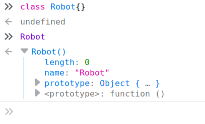
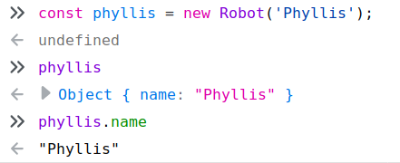
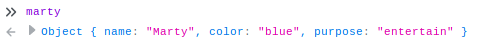
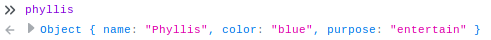
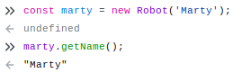
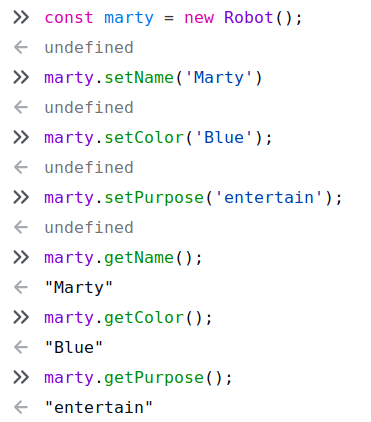
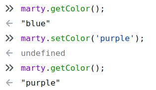

Introduction To Object Oriented Programming
===
Lesson time: 60-75 minutes

Table of Contents
---
[Audience](#audience)

[Lesson Materials](#lesson-materials)

[Overview](#overview)

[Classes (15-20 minutes)](#classes)

[Properties and Methods (20-30 minutes)](#properties-and-methods)

[Exercise 1: Add a new method to the `Robot` class (10 minutes)](https://github.com/asciimo/trilogy/blob/master/oop.md#exercise-1-add-a-new-method-to-the-robot-class-10-minutes)

[Exercise 2: Create a new class  (15 minutes)](https://github.com/asciimo/trilogy/blob/master/oop.md#exercise-2-create-a-new-class--15-minutes)

[Topics for Further Learning](https://github.com/asciimo/trilogy/blob/master/oop.md#topics-for-further-learning)

Audience
---
This lesson is intended for beginning students who have some experience with
fundamental procedural programming concepts, particularly **variables**,
**scope**, **data structures** and **functions**. Students should be confident
in their ability to write useful programs, and eager to learn new tools and
techniques for building more complex applications and systems. Familiarity with
JavaScript is useful, but not necessary.

Lesson Materials
---
Students should have access to a Web browser with a JavaScript console, such as
Firefox or Chrome. Examples in this document will use Firefox.

Overview
---
In this lesson, we will introduce students to the important concepts of Object
Oriented programming.  We will start by describing how **classes** enable
programmers to model real-world objects in software, and enforce this idea by
creating a class and **object instances** in a browser's JavaScript console. We
will then explain how **properties** (variables) and **methods** (functions)
give object instances their attributes and behavior. We'll cover the power of
the special`constructor()` method, and the value of **setter** and
**getter** methods for writing and reading object instance properties.

Classes
---

### Instructor Notes

#### Goals
At the end of this section, students will:
  - understand that **classes** are blueprints that can create
      **object** instances.
  - be able to declare **classes**
  - **instantiate** object instances 

#### Tips
Throughout this lesson, we will be alternating instruction with practice to
enforce key concepts and keep students engaged. We will be using the JavaScript
interpreter in a Web browser for exercises, but it's important that students
understand that these concepts are universal. If students get hung up on the
particulars of JavaScript's OOP syntax or mechanics, gently guide them back into
the conceptual realm. After this section, all students should be able type code
into the JavaScript console and execute it while understanding that this is just
one implementation of an OOP interface.

We will often refer to Object Oriented Programming as "OOP," for brevity. But
you may want to say "Object Oriented Programming" to avoid confusion. 

### Teach to the students (15-20 minutes)
Object Oriented Programming (OOP) is a concept in software development that
allows programmers to model real world objects. This paradigm is powerful
because it allows humans to more easily manage complex software by leaning
heavily on our intuitive understanding of the world.

Find an object nearby; a desk, a pencil, a laptop, a colleague, or an
instructor. All of these objects can be described in OOP using **classes**,
which define their properties and behaviors. For example, let's look at a pen.

***Ask the class***
> What are some properties that uniquely describe this specific pen?

    Focus on specific attributes of the pen (or other object) in this example:
    color, length, ink type, printed words, smell, condition, etc.

These are the properties of this specific pen. Some other pen may have
completely different properties, but it will still be a class of object that
humans recognize as "a pen." We can create an abstract model of this type of
object using a class, and generalize all pen properties into categories. This
table illustrates how we might  do this, where the first column is the abstract
property, and the other two columns are concrete values held by specific
instances of the class of object we know as "a pen:"

| abstract property | pen 1      | pen 2      |
| ---               | ---        | ---        |
| manufacturer      | Bic        | Montblanc  |
| material          | plastic    | solid gold |
| refillable        | false      | true       |
| tip               | ballpoint  | nib        |
| color             | white      | gold       |
| length            | 5"         | 6.5"       |
| cost              | 0.79       | 1600.00    |

By describing the class of object known as "a pen" in abstract terms, we can
easily describe two wildly different instances such as a disposable ballpoint
pen and an absurdly expensive Montblanc fountain pen.

We can even model intangible things using OOP, such as Web pages, calendar
reminders, ocean temperature readings, and public transportation ridership
trends. We'll focus on real-world objects for now, because they're familiar and
easier to talk about. 

***Ask the class***
> What are some practical applications of modeling things and concepts as
> objects in software?

    Good answers might include:
      - tell a machine how to make a pen
      - track company assets
      - build an employee database
      - run global warming simulations
      - dynamically add or remove busses and trains from the transit system to
        meet demand
      - sell items on an e-commerce Web site 

Let's create a JavaScript class for an object that is becoming increasingly more
familiar in our everyday lives: a robot. 

Before we start, it's important to understand that OOP 
is a concept, or a *paradigm*, supported by most popular programming languages.
Some languages, such as Java and C++ are built around this paradigm, while others
such as Python and JavaScript support it, but allow you to freely mix and
match OOP and procedural features. In this lesson, we will use
JavaScript because it's readily available in Web browsers and gives us instant
feedback without having to compile or build anything. Just keep in mind that the
concepts we'll cover are shared by all languages that support OOP.

Let's look at the structure of an empty Robot class in JavaScript. Open the
JavaScript console in a browser and enter the following:

```javascript
class Robot {}
```

Congratulations! You have **declared** a Robot class! It does absolutely
nothing, but let's look at its parts:

1. The **class** keyword tells the JavaScript interpreter that we're
   **declaring** a class. In fact, what you just typed is called a **class
   declaration**.
1. The name, *Robot*, gives us (and the JavaScript interpreter) a unique name to
   reference this class later.
1. The body of the class is contained within curly braces, and is currently
   empty. This is where we will define the robot's characteristics and
   behavior.

We can see what we have created by typing `Robot` into the console. The
JavaScript interpreter will respond with whatever the name references in its
memory:



This is how the JavaScript interpreter in Firefox displays a class in memory.
We can expand the arrows to drill down into the `Robot` "function," (JavaScript
represents classes as functions, which we'll talk about in a moment), and we
will quickly descend into a puzzling JavaScript rabbit hole. Let's not do that
right now. The important thing to note is that the interpreter knows that this
class has a name: `Robot`. 

But what do we do with a class? A class is an abstract **object** blueprint
that can create concrete **object instances**.  This is where OOP gets its
name. In order to create a blue, dancing `Robot` named Marty, we must first
have a blueprint, or **class**, that defines a `Robot` object's attributes and
behavior. 

Even though our `Robot` blueprint is bare-bones, we can already
**instantiate**, or create an instance of, a `Robot` object. Let's make a new
`Robot` instance in the browser console:

```javascript
const marty = new Robot();
```

Here, we are assigning a new instance of the `Robot` class to the variable
`marty`. There are two important parts of the JavaScript syntax for
instantiating an object:
1. The `new` keyword, which tells the interpreter that we are creating a new
   instance of the `Robot` class. This is common in many other languages that
   support OOP.
2. The parentheses following the class name `Robot`, which imply that we are
   actually calling a function.

Let's talk about those parentheses. When we create an object from a class,
JavaScript is quietly calling a function built in to all classes:
`constructor()`. Even though we didn't declare this function, it is automatically
added to every class, and it's the first function--in OOP terms, the first 
**method**--that gets called when we instantiate an object. We'll talk more
about the usefulness of `constructor()` shortly.

Let's look at the subtle difference between the `Robot` class and the `marty`
instance in the console:


The console identifies the `Robot` class as the JavaScript type `function`, but
it identifies `marty` as the JavaScript type `Object`. If we expand `marty` by
clicking on the arrow, we see that that he is empty. It will be our job to bring
him to life with **properties** and **methods**.

Properties and Methods
---

### Instructor Notes

#### Goals
At the end of this section, students will:
  - understand how the default **constructor** method initializes an object instance
  - understand that `this` is an interface to the **scope** of an object instance 
  - declare **properties** and **methods** in a **class**
  - be able to override the default constructor to declare object properties
  - instantiate different **objects** from a class
  - call **methods** on an object instance.
    - **getter** and **setter** methods for reading and writing property values on an object instance
    - arbitrary methods to define object behaviors 

#### Tips
While there are some JavaScript idiosyncrasies that can't be avoided while
interacting with classes, don't spend too much time addressing them.  Remind
students that we are learning general concepts that apply to all
OOP-friendly languages, and the particulars of JavaScript OOP can be explored
on their own time.

### Teach to the students (20-30 minutes)

*Attributes* such as name, color and size, are defined using variables called
**properties**.

*Behaviors*, such as speak, move, and destroy are defined using functions
called **methods**. 

Let's flesh out the abstract notion of a `Robot` by adding some **properties**.
Remember that `constructor()` is automatically called when a new object is
instantiated from a class. This method is completely customizable, giving us an
opportunity to do some work when the object is initialized. We'll use
`constructor()` to define properties on a `Robot` instance.

Every robot should have a name, so let's start by declaring a `name` property
in the `Robot` class. Refresh your browser to clear out the `Robot` we declared
earlier, and let's redeclare it as follow: 

```javascript
class Robot {
  constructor() {
    this.name = 'Marty';
  }
}
```


In JavaScript, class properties are declared using the keyword `this`. `this`
refers to the **scope**, or context, of the object described by the class.
That dot between `this` and `name` is aptly called the **dot operator**. It
provides access to an object instance's properties and methods. In this case,
`this` is an alias for the current object instance. You can think of it as an
object's instance's notion of itself. `this.name = 'Marty'` is analogous an
object instance saying "my name is Marty".

We can reference `this` from anywhere in a class, and have access to the
specific properties and methods of a particular object when it is instantiated.
`this` is common in many programming languages that support OOP, but it can get a little
tricky in JavaScript because `this` can be used in other contexts outside of
OOP. For now, we only need to remember that we will use `this` when referencing
properties and methods within in a class.

Let's break down what happened in the above example:

1. We created a new `Robot` instance by calling `new Robot()`, and assigned it to
   the `marty` variable.
2. `constructor()` was automatically called, assigning the string value `Marty`
   to the instance's `name` property using the `this` keyword and the dot operator.
3. We typed `marty` into the console, and it displayed the object instance with
   the `name` property set to `Marty`.

***Ask the class***
> Does this make sense?

    This is a good time to sync up with the class to make sure everyone is on
    the same page. `this` may be problematic. Enforce the idea that `this` is
    synonymous with "my". It's abstract within the class, but it will be bound to
    the scope of object instances, as we'll demonstrate in a moment.

Now we're going to interact with Marty. We're going to read his name by
directly referencing the `name` property on the object instance using the dot
operator:


The console displays the value of the `name` property. It is the string, "Marty".

***Ask the class***
> Why didn't we use `this` when accessing Marty's name?

    Because `this` is abstract within the class. When an object is instantiated, its
    properties are concrete, and can be accessed by using the dot operator on the 
    specific object instance.

Now we have a class that defines `Robot` objects, and it creates instances with
the name "Marty". So far, it only creates robots named Marty.

***Ask the class***
> What if we want to create another robot named Phyllis? 

    Encourage students to puzzle this out. One solution might be to create a new
    class, `PhyllisRobot`, where `constructor()` sets the name to "Phyllis". Another
    might be to modify the `Robot` class to set the name to "Phyllis" instead of
    "Marty". If only there were a way to set the robot name at the time of 
    object instantiation...

A very useful feature of `constructor()` is that it can take arguments passed
to the class when a new object instance is created. This allows us to reuse the
same class to instantiate objects with different properties. Let's use this
feature to pass a robot's name into the `Robot` class when we create a new
object instance. First, we will modify `constructor()` to expect a `name`
argument. Refresh your browser and enter the following into the console:

```javascript
class Robot {
  constructor(name) {
    this.name = name;
  }
}
```

To create a robot name Phyllis, we can simply...

```javascript
const phyllis = new Robot('Phyllis');
```

We can see that our new `Robot` instance is named Phyllis.

@todo redo screenshot with Phyllis



Feel free to spend a minute creating more robots with different names!

We can all agree that the most useful robots in the world do more than simply
possess a name.

***Ask the class***
> What are some other attributes that might belong to a robot?

    The sky's the limit on this one. Obvious properties include height, weight,
    speed, fuel, color, purpose, location, serial number...

Let's add some of these properties to our `Robot` class. For now, we can
hard-code the property values in the constructor as we initially did for `name`.
(Don't forget to refresh your browser):

```javascript
class Robot {
  constructor(name) {
    this.name = name;
    this.color = 'blue';
    this.purpose = 'entertain';
  }
}
```

Let's see what Marty looks like now:

```javascript
const marty = new Robot('Marty');
``` 



Marty is really coming to life. And so is Phyllis:

```javascript
const phyllis = new Robot('Phyllis');
```



As it stands, we can create an army of differently named, blue, dancing robots.
Awesome for sure, but limiting.  What if we want a squad of robots that sing?

***Ask the class***
> How can we assign different values to these new properties when we instantiate a `Robot`? 

    Students should be able to solve this problem by parameterizing the other attributes,
    as we did for `name`.

If we parameterize the new properties, our `constructor()` might look like this:

```javascript
class Robot {
  constructor(name, color, purpose) {
    this.name = name;
    this.color = color;
    this.purpose = purpose;
  }
}
```
Now we can create a rich multitude of robots with varying colors and purposes.
But we will soon grow tired of this limited set of robot properties, and want to
add more. We might add several dozen or even hundreds more properties. If we
parameterize all of these properties in the constructor it will become unwieldy
because we will have to remember the order of the arguments every time we
instantiate a `Robot`.

Furthermore, what if we want to modify a robot that already exists? Right now,
we can't. We'd have to destroy it and create a new one with different
properties. Fortunately, there is a way we can more gracefully provision each
robot and even alter it after it has been instantiated.

There is a types of methods in OOP called **setters** and **getters** (some
people call them **mutators** and **accessors**). Their purpose is to read,
assign, or change the properties of an object instance after it has been
instantiated. So far, we have only assigned values to properties at the time of
instantiation using arguments passed to the constructor. With **setters** and
**getters**, we can instantiate an object and then anytime afterward set or get
its property values. There is nothing special about these methods, but they
follow these conventions:

  - A *setter*, which assigns or changes an object instance's property, begins 
    with `set`. For example, `setName()`.
  - A *getter*,  which reads an object instance's property, begins
    with `get`. For example, `getName()`.
 
Let's add a getter to `Robot` that returns the `name` property. The syntax for
declaring a method in a class is the same as creating a function anywhere in
JavaScript, except that it is declared in the class body:

```javascript
class Robot {
  constructor(name, color, purpose) {
    this.name = name;
    this.color = color;
    this.purpose = purpose;
  }
  getName() {
    return this.name;
  }
}
```

Now we can create a new Marty, and get his name using `getName()`:

```javascript
const marty = new Robot('Marty');
marty.getName();
```



Here we are able to call the `getName()` method on Marty by using the dot
operator, just as we did when accessing `this` in `constructor()`. You may
recall that when we first gave `Robot` a name property, we were able to read it
directly from an object instance like this:

```javascript
marty.name
```

***Ask the class***
> Is it really better to create a method to do this for us? 

    It might be difficult to tease a "correct" answer out of students at this
    point, but it's worth getting their gears moving. Ideally, they will recognize
    that `getName()` is a first-class function, and that we can do whatever we want
    before returning the value of `this.name`, such as prefix the name with `Robot: `,
    ensure that the first letter is capitalized, or even load the value from a
    database.

One benefit of using setters and getters is that they can provide a predictable,
public interface to the outside world without exposing its private, inner
workings. For example, what if inside the `Robot` class, we stored the value for
a robot's name in some other property, like `robotName`? Or somewhere else
completely, like in a database? A programmer who instantiates a `Robot` object
should not have to look at the class source code to determine how to get
the `Robot` instance's name. They should be able to intuitively call `getName()`
and be done with it. As the author of the `Robot` class, you could document this
public interface to the robot's name, and do anything you want inside the class to
generate it. 

Some OOP-compatible languages allow programmers to explicitly label properties
and methods as **private** or **public**, to control access from the outside. If
code tries to access or change a method or property marked private, the
interpreter or compiler will throw an error. JavaScript does not provide this
level of protection, or enforce any access control. We will make do by following
the convention of using getters and setters to suggest the proper ways to 
access our properties and methods.

***Ask the class***
> Why would you want to control how properties and methods are accessed and
> called in your class?
    
    Some good answers might include:
      - To make sure users of the class don't call methods in unpredicatable
        or dangerous ways.
      - To ensure that property values are valid before returning them. 
 
OK, that was a lot of talk about setters and getters. Now let's code some up.
We'll move the remaining parameters to `Robot` from the constructor into setters
and getters:

```javascript
class Robot {
  constructor() {
    this.name = '';
    this.color = '';
    this.purpose = '';
  }

  setName(name) {
    this.name = name;
  }

  getName() {
    return this.name;
  }

  setColor(color) {
    this.color = color;
  }

  getColor() {
    return this.color;
  }

  setPurpose(purpose) {
    this.purpose = purpose;
  }

  getPurpose() {
    return this.purpose;
  }

}
```

Even though we no longer pass property values as arguments to the `Robot`
constructor, we will still initialize the properties to empty strings. This is
another convention that helps document the properties defined in the class. Note
that we could even set these to default values, rather than empty strings.

Let's take these new setter and getter methods for a spin:



Let's take a look at how we can change Marty's color:



### Exercise 1: Add a new method to the `Robot` class (10 minutes)
Using what we have learned about defining methods in a class, create a new
`Robot` method, `doPurpose()`. 
  - This method should call `console.log()` to announce what a `Robot` instance is currently doing.
  - Marty, being an entertainment robot, should say "I'm dancing, I'm dancing!"
  - Phyllis should be configured to be a computing robot, and say "I'm crunching
    numbers."

Hint: to pull this off, you will likely need to store the announcement text in a
new property, and set it uniquely for each `Robot` instance.

### Exercise 2: Create a new class  (15 minutes)
Think of a real-world object that might be fun to model in a new class. For example: Fruit,
Animal, Car, Athlete, Book, Game, Elevator.
  - Define properties, setters, and getters
  - Define at least two methods that perform a behavior associated with the
    object.
  - Make at least two instances of the object, and play around with their
    properties and methods.

***Ask the class*** (Time permitting)
> Can you think of a real-world object that might be difficult to express in
> OOP? What characteristics or behaviors seem challenging? 

    Try to model some of the students' suggestions with appropriate properties
    and methods. Hopefully you will find an opportunity to describe some of the
    advanced concepts under Topis for Further Learning that might help.

Topics for further learning
---
  - inheritance
  - encapsulation
  - polymorphism
  - multiple inheritance
  - composition
  - interfaces
  - factory pattern

