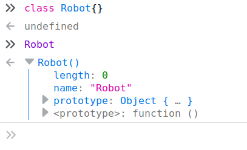

Introduction To Object Oriented Programming
===
Lesson time: 90 minutes

Audience
---
This lesson is inteded for students who have some experience with fundamental
procedural programming concepts, particularly **variables**, **scope**, **data
structures** and **functions**. Students should be confident in their ability to
write useful programs, and eager to learn new tools and techniques for building
more complex applications and systems. 

Lesson Materials
---
Students should have access to a Web browser with a Javascript console, such as
Firefox or Chrome. 

Overview
---
In this lession, we will introduce students to the important concepts of Object
Oriented programming.  We will start by describing how **classes** enable
programmers to model real-world objects in software, and enforce this idea by
creating a class and **object instances** in a browser Javascript console. We
will then take students deeper into the ideas of **encapsulation**,
**inheritance**, and **polymorphism**, with interactive Javascript exercises
long the way. Time permitting, we will conclude with a discussion of some
problematic aspects of OOP such as **multiple inheritance**, and how it might be
avoided with **composition**.

Introduction to Classes
---

### Instructor Notes

#### Goals
  - Students will understand what **classes**
  - Students will be able to interact with classes and objects in the Javascript console

#### Tips
Throughout this lesson, we will be alternating instruction with practice to
enforce key concepts and keep students engaged. We will be using the Javascript
interpreter in a Web browser for exercises, but it's important that students
understand that these concepts are universal. If students get hung up on the
particulars of Javascript's OOP sytnax or mechanics, gently guide them back into
the conceptual realm. After this section, all students should be able type code
into the Javascript console and execute it while understanding that this is just
one implementation of an OOP interface.

We will often refer to Object Oriented Programming henceforth as "OOP," for brevity. But you may want to says "Object Oriented Programming" to avoid confusion. 

### Teach to the students
Object Oriented Programming (OOP) is a concept in software development that
allows programmers to model real world objects. Find an object nearby; a desk, a
pencil, a laptop, a colleague, or an instructor. All of these objects can be described in OOP using **classes**. We can even model intangible objects, such as  web pages, calendar reminders, ocean temperature readings, and public transportation ridership trends.

***Ask the class***
> Why would you want to do this in software? 

    Good answers might include:
      - To tell a machine how to make a pencil
      - To track company assets
      - To build an employee database
      - To run global warming simulations
      - To dynamically add or remove busses and trains from the transit system

Let's create a class for an object that is becoming increasingly more familiar in our everyday lives: a robot. 

Before we start, it's important to understand that Object Oriented Programming
is a concept, or a *paradigm*, supported by most popular programming languages.
Some languages, such as Java and C++ are built around this paradim, while others
such as Python and Javascript support it, allowing you to freely mix and match OOP and procedural aspects as you see fit. In this lesson, we will use Javascript because it's readily available in Web browsers and gives us instant feedback without having to compile or build anything. Just keep in mind that the concepts we'll cover are shared by all languages that support object oriented programming.

Let's look at the structure of an empty Robot class in Javascript. Open your Javascript console and enter the following:

```javascript
class Robot {}
```

Congratulations! You have **declared** a Robot class that does absolutely nothing. But let's look at its parts:

1. The **class** keyword tells the Javascript interpreter that we're **declaring** a class. In fact, what you just typed is called a **class declaration**.
1. The name, *Robot*, gives us (and the Javscript interpreter) a unique name to reference this class later.
1. The body of the class is contained within curly braces, and is currently
   empty. This is where we will definte the robot's characteristics and
   behavior.

We can see what we have created by typing `Robot` into the console. The
Javascript interpreter will respond with whatever the name references in its
memory:



This is how the Javascript interpreter in Firefox displays an class in memory.
You can expand the arrows to drill down into the `Robot` "function," (Javascript represents classes as functions, but that's not important), and you will quickly descend into a puzzling Javascript rabbit hole. (Please come back from the rabbit hole if you are already in it!) The imporant thing to note is that the
interpreter knows that this class has a name: `Robot.` 

But what do we do with a class? A class is a blueprint, or a recipe for creating
**instances** of itself, called **objects**. This is where OOP gets its name. In
order to create a blue, dancing `Robot` named Philip, we must first have a
blueprint, or **class**, that defines a `Robot`'s attributes and behavior. 

Even though our `Robot` blue print is bare-bones, we can instantiate a `Robot`
object. Let's make a new `Robot` instance in your browser console:

```javascript
const marty = new Robot();
marty
```

Here, we are assigning a new instance of the `Robot` class to the variable
`marty`. There are two important parts of the Javascript syntax for
instantiating an object:
1. The `new` keyword, which tells the interpreter that we are insantiating a
   class. (This is common in many other languages that support OOP.)
2. The parentheses following the class name `Robot`, which imply that we are
   actually calling a function.

Let's talk about those parentheses. When we create an object from a class,
Javascript is quietly calling a function built in to all classes: `constructor()`. Even though we didn't define this function, it is automatically added to every class, and it's the first function--in OOP terms, **method**--that gets called when we instantiate an object.  It is called `constructor()`, because it allows us to do things when the object is first constructed. By default, this method does nothing. But we're about to change that!


*Attributes* such as name, color and size, are defined using variables called
**properties**.

*Behaviors*, such as speak, move, and destroy are defined using functions  called **methods**. 

Let's flesh out the abstract notion of a `Robot` by adding some **properties**.
Every robot should have a name, so let's start there. In order to do this in Javascript, we have to understand a bit more about Javascript classes. Don't get to

Refresh your browser to clear out the `Robot` we declared earlier. 

***Ask the class***
> What are some other attributes that might belong to a robot?

    The sky's the limit on this one. Obvious properties include height, weight,
    speed, fuel, color, gender


***Ask the class***
> Can you think of a real-world object that might be difficult to express using a **class**? Which **properites** and **methods** seem difficult to model? 

    Try to model some of the students' suggestions with appropriate properties
    and methods. Hopefully you will find an opportunity where some forthcoming
    concepts will help, providing a segue into the next section.


